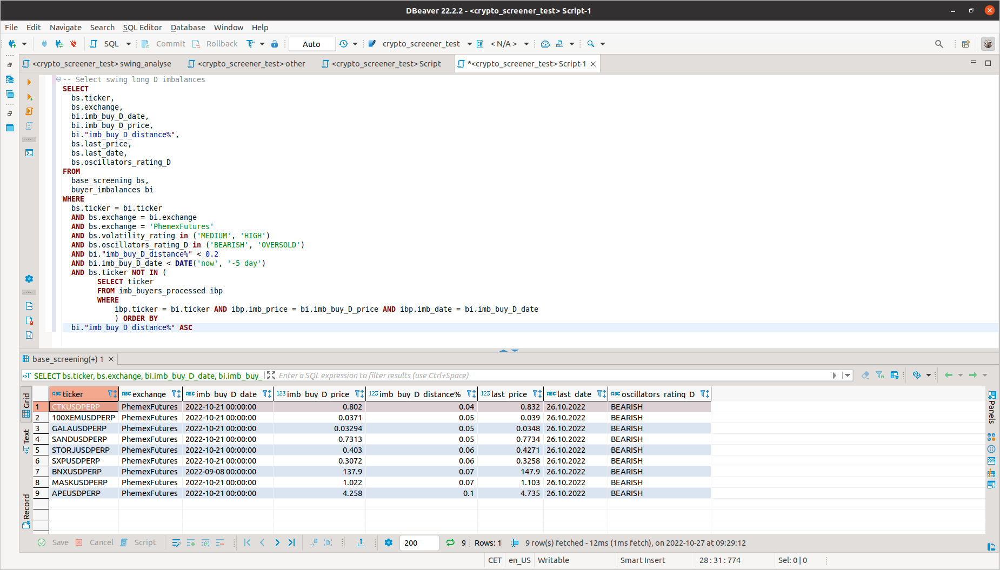

# Crypto screener
Application for calculating the ratings based on the indicators (SMA 20, SMA 50, SMA 200), oscillators (RSI) and volatility (ATRW%) for cryptocurrencies on different exchanges.

* Supported exchanges:
    * Phemex futures
    * Okx spot
    * SimpleFx cfd



## Keywords

* **RSI (Relative Strength Index)**: A technical indicator, used in momentum trading, that measures the speed of a securities recent price change.
* **SMA (Simple Moving Average)**: A simple moving average (SMA) is a calculation that takes the arithmetic mean of a given set of prices over a specific number of days in the past.
* **ATR (Average True Range**: A technical analysis indicator that measures market volatility by decomposing the entire range of an asset price for that period.
* **Correlation**: A statistic that measures the degree to which two securities move in relation to each other.


## How to build
```bash
./build.sh
```

## How to deploy
```
./deploy.sh
```

## How to prepare
```bash
./prepare.sh
```

## How to run
```bash
./run.sh
```

## Technologies
* Python 3
* Pandas
* Pandas-ta
* CCXT
* YFinance

[Release notes](RELEASE_NOTES.md)
